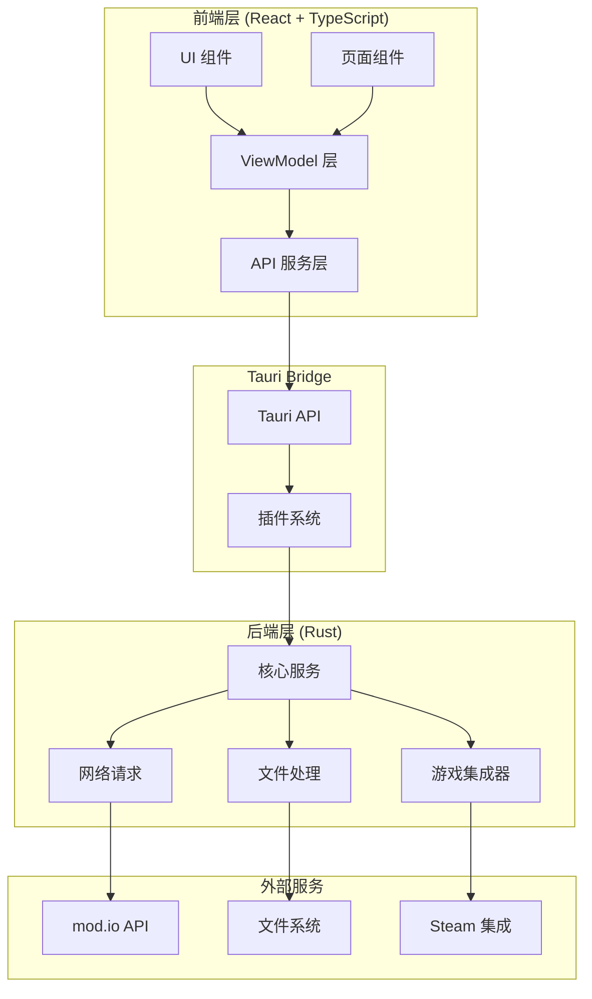
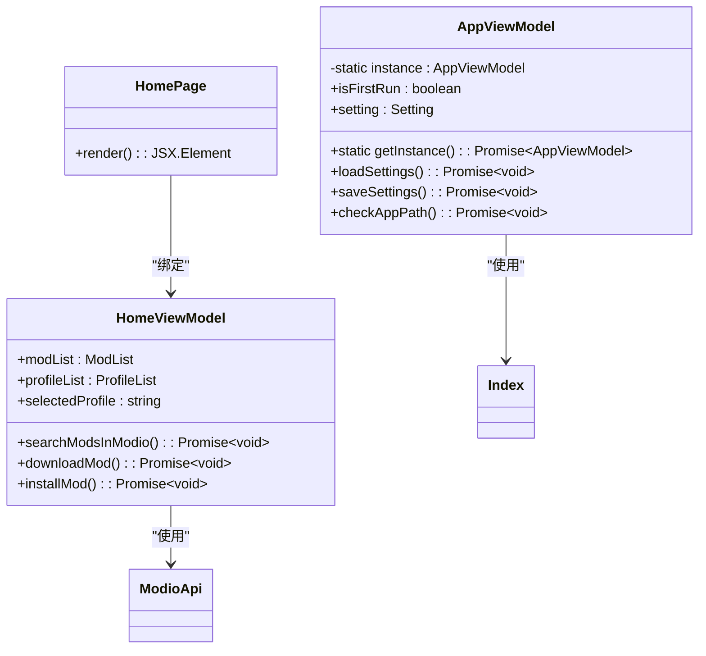
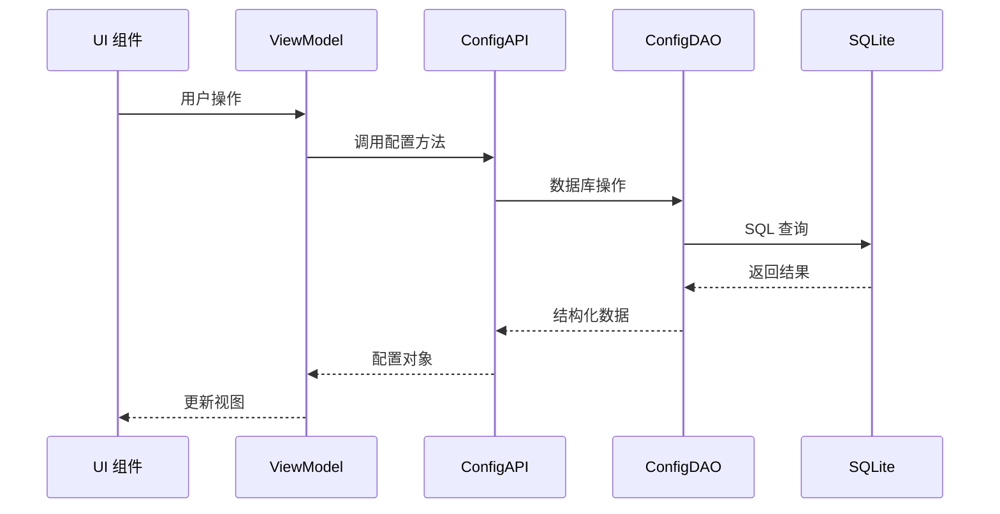
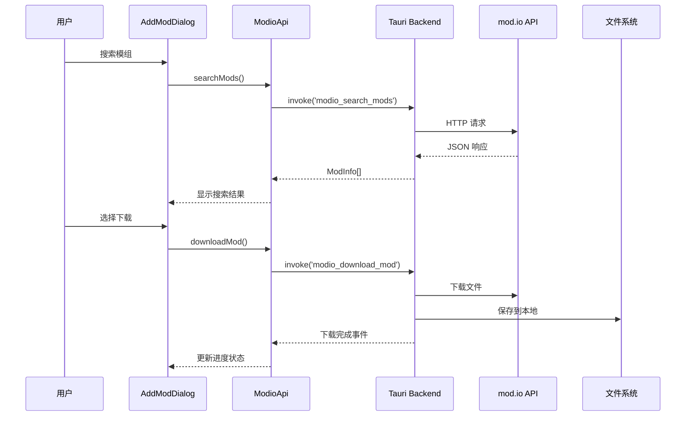

# MintCat 技术规范文档

## 1. 项目概述

### 1.1 项目简介
MintCat 是一个基于 Tauri 框架构建的跨平台桌面应用程序，专为 Deep Rock Galactic 游戏的模组管理而设计。项目采用前后端分离架构，前端使用 React + TypeScript，后端使用 Rust，通过 mod.io 平台提供模组搜索、下载、安装和管理功能。

### 1.2 核心特性
- **模组管理**: 本地和在线模组的添加、更新、删除和重命名
- **mod.io 集成**: 与 mod.io 平台的完整集成，支持搜索和下载
- **游戏集成**: 深度集成 Deep Rock Galactic，支持 PAK 文件操作
- **多语言支持**: 基于 i18next 的国际化框架
- **主题系统**: 支持多种界面主题切换

### 1.3 目标用户
- Deep Rock Galactic 游戏玩家
- 模组开发者和爱好者
- 需要便捷模组管理工具的用户

## 2. 技术栈

### 2.1 前端技术栈
| 技术 | 版本 | 用途 |
|------|------|------|
| React | 19.1.0 | UI 框架 |
| TypeScript | 5.2.2 | 类型系统 |
| Vite | 6.2.6 | 构建工具 |
| Ant Design | 5.27.1 | UI 组件库 |
| React Router DOM | 7.5.1 | 路由管理 |
| i18next | 25.1.2 | 国际化 |
| react-i18next | 15.5.1 | React 国际化绑定 |

### 2.2 后端技术栈
| 技术 | 版本 | 用途 |
|------|------|------|
| Tauri | 2.8.4 | 桌面应用框架 |
| Rust | Edition 2021 | 系统编程语言 |
| reqwest | 0.12.15 | HTTP 客户端 |
| serde | 1.0 | 序列化/反序列化 |
| zip | 2.2.0 | 压缩文件处理 |
| repak | latest | UE4 PAK 文件处理 |

### 2.3 数据存储
| 技术 | 版本 | 用途 |
|------|------|------|
| SQLite | - | 本地数据库 |
| better-sqlite3 | 11.10.0 | Node.js SQLite 驱动 |
| Drizzle ORM | 0.43.1 | 对象关系映射 |
| Tauri Store Plugin | ~2 | 配置存储 |

### 2.4 开发工具
| 工具 | 版本 | 用途 |
|------|------|------|
| pnpm | latest | 包管理器 |
| Tauri CLI | 2.5.0 | 开发工具链 |
| TypeScript Compiler | 5.2.2 | 类型检查 |

## 3. 项目架构

### 3.1 整体架构图



### 3.2 目录结构
```
mintcat/
├── src/                          # 前端源代码
│   ├── apis/                     # API 服务层
│   ├── components/               # UI 组件
│   ├── dialogs/                  # 对话框组件
│   ├── pages/                    # 页面组件
│   ├── storage/                  # 数据存储
│   ├── vm/                       # ViewModel 层
│   ├── locales/                  # 国际化文件
│   ├── themes/                   # 主题配置
│   └── utils/                    # 工具函数
├── src-tauri/                    # 后端源代码
│   ├── src/
│   │   ├── capability/           # 基础功能模块
│   │   └── integrator/           # 游戏集成模块
│   ├── capabilities/             # Tauri 能力配置
│   └── assets/                   # 静态资源
├── public/                       # 静态文件
└── 配置文件
```

### 3.3 MVVM 设计模式

项目采用 MVVM (Model-View-ViewModel) 设计模式：



## 4. 核心模块详细规范

### 4.1 API 服务层规范

API 服务层位于 `src/apis/` 目录，负责封装与 Tauri 后端的通信：

#### 4.1.1 Index 配置管理
```typescript
export class Index {
    // 获取配置值
    static async get<T>(key: string, defaultValue: T): Promise<T>
    
    // 设置配置值
    static async set<T>(key: string, value: T): Promise<void>
    
    // 配置迁移
    static async migrate(): Promise<void>
    
    // 获取所有配置
    static async getAll(): Promise<Record<string, any>>
}
```

#### 4.1.2 ModioApi mod.io 集成
```typescript
export class ModioApi {
    // 搜索模组
    static async searchMods(query: string, limit?: number): Promise<ModInfo[]>
    
    // 下载模组
    static async downloadMod(modId: number, filePath: string): Promise<void>
    
    // 获取用户信息
    static async getUserInfo(): Promise<UserInfo>
    
    // 获取模组详情
    static async getModDetails(modId: number): Promise<ModInfo>
}
```

#### 4.1.3 IntegrateApi 游戏集成
```typescript
export class IntegrateApi {
    // 安装模组
    static async installMod(modPath: string, gamePath: string): Promise<void>
    
    // 卸载模组
    static async uninstallMod(modId: string): Promise<void>
    
    // 检查游戏路径
    static async checkGamePath(path: string): Promise<boolean>
    
    // 获取安装状态
    static async getInstallStatus(): Promise<InstallStatus>
}
```

### 4.2 组件系统规范

#### 4.2.1 UI 组件规范
所有 UI 组件应该：
- 使用 TypeScript 严格类型检查
- 支持主题切换
- 遵循 Ant Design 设计规范
- 具备国际化支持

```typescript
interface ComponentProps {
    className?: string;
    style?: React.CSSProperties;
    children?: React.ReactNode;
}

export const ExampleComponent: React.FC<ComponentProps> = ({ 
    className, 
    style, 
    children 
}) => {
    const { t } = useTranslation();
    
    return (
        <div className={className} style={style}>
            {children}
        </div>
    );
};
```

#### 4.2.2 对话框组件规范
对话框组件应该：
- 使用 Ant Design Modal 组件
- 支持异步操作
- 具备错误处理机制
- 提供加载状态指示

```typescript
interface DialogProps {
    visible: boolean;
    onClose: () => void;
    onSuccess?: (result: any) => void;
    onError?: (error: Error) => void;
}

export const ExampleDialog: React.FC<DialogProps> = ({ 
    visible, 
    onClose, 
    onSuccess, 
    onError 
}) => {
    // 对话框实现
};
```

### 4.3 数据存储规范

#### 4.3.1 数据库 Schema
```sql
-- 设置表
CREATE TABLE settings (
    id INTEGER PRIMARY KEY,
    version TEXT NOT NULL,
    modio_oauth TEXT,
    modio_uid INTEGER,
    drg_pak_path TEXT,
    gui_theme TEXT DEFAULT 'light',
    language TEXT DEFAULT 'en',
    cache_path TEXT,
    config_path TEXT,
    ue4ss TEXT,
    created_at INTEGER DEFAULT CURRENT_TIMESTAMP,
    updated_at INTEGER DEFAULT CURRENT_TIMESTAMP
);

-- 配置数据表
CREATE TABLE config_data (
    id INTEGER PRIMARY KEY,
    key TEXT UNIQUE NOT NULL,
    value TEXT,
    type TEXT DEFAULT 'string',
    created_at INTEGER DEFAULT CURRENT_TIMESTAMP,
    updated_at INTEGER DEFAULT CURRENT_TIMESTAMP
);
```

#### 4.3.2 数据模型定义
```typescript
interface AppSettings {
    version: string;
    modio_oauth?: string;
    modio_uid?: number;
    drg_pak_path?: string;
    gui_theme: 'light' | 'dark' | 'pink';
    language: string;
    cache_path: string;
    config_path: string;
    ue4ss?: string;
}

interface ModInfo {
    id: number;
    name: string;
    description: string;
    version: string;
    author: string;
    downloadUrl: string;
    thumbnailUrl?: string;
    tags: string[];
    size: number;
    createdAt: Date;
    updatedAt: Date;
}
```

### 4.4 后端服务规范

#### 4.4.1 Tauri 命令规范
```rust
// 命令定义规范
#[tauri::command]
async fn command_name(
    app: AppHandle,
    param1: String,
    param2: Option<i32>
) -> Result<ReturnType, String> {
    // 命令实现
    match perform_operation(param1, param2).await {
        Ok(result) => Ok(result),
        Err(e) => {
            log::error!("Command failed: {}", e);
            Err(format!("操作失败: {}", e))
        }
    }
}
```

#### 4.4.2 错误处理规范
```rust
// 自定义错误类型
#[derive(Debug, thiserror::Error)]
pub enum MintCatError {
    #[error("文件操作失败: {0}")]
    FileOperation(#[from] std::io::Error),
    
    #[error("网络请求失败: {0}")]
    Network(#[from] reqwest::Error),
    
    #[error("配置错误: {message}")]
    Config { message: String },
    
    #[error("游戏集成错误: {message}")]
    Integration { message: String },
}

// 结果类型别名
pub type Result<T> = std::result::Result<T, MintCatError>;
```

## 5. 开发规范

### 5.1 代码风格规范

#### 5.1.1 TypeScript 规范
```typescript
// 文件命名：PascalCase.tsx 或 camelCase.ts
// 组件命名：PascalCase
// 函数命名：camelCase
// 常量命名：UPPER_SNAKE_CASE
// 接口命名：PascalCase，以 I 开头（可选）

// 导入顺序
import React from 'react';
import { Button } from 'antd';
import { invoke } from '@tauri-apps/api/core';

import { Index } from '../apis/Index';
import { ComponentA } from './ComponentA';

// 类型定义
interface Props {
    title: string;
    onAction?: () => void;
}

// 函数组件
export const Component: React.FC<Props> = ({ title, onAction }) => {
    // 组件逻辑
};
```

#### 5.1.2 Rust 规范
```rust
// 文件命名：snake_case.rs
// 模块命名：snake_case
// 函数命名：snake_case
// 类型命名：PascalCase
// 常量命名：UPPER_SNAKE_CASE

// 导入顺序
use std::collections::HashMap;
use std::path::Path;

use serde::{Deserialize, Serialize};
use tauri::{AppHandle, command};

use crate::capability::download;

// 结构体定义
#[derive(Debug, Serialize, Deserialize)]
pub struct ModInfo {
    pub id: u64,
    pub name: String,
    pub version: String,
}

// 函数定义
#[command]
pub async fn install_mod(
    app: AppHandle,
    mod_path: String,
    game_path: String,
) -> Result<(), String> {
    // 函数实现
}
```

### 5.2 Git 提交规范
```bash
# 提交格式
<type>(<scope>): <description>

# 类型
feat:     新功能
fix:      修复 bug
docs:     文档更新
style:    代码格式调整
refactor: 代码重构
test:     测试相关
chore:    其他更改

# 示例
feat(api): 添加模组搜索功能
fix(ui): 修复主题切换问题
docs(readme): 更新安装说明
```

### 5.3 分支管理规范
```bash
# 主分支
main          # 生产环境代码
develop       # 开发分支

# 功能分支
feature/xxx   # 新功能开发
bugfix/xxx    # 问题修复
hotfix/xxx    # 紧急修复
release/xxx   # 发布准备
```

## 6. API 接口规范

### 6.1 前端 API 调用规范
```typescript
// API 调用标准格式
export class ApiService {
    static async methodName<T>(
        param1: string,
        param2?: number
    ): Promise<T> {
        try {
            const result = await invoke<T>('backend_command', {
                param1,
                param2
            });
            return result;
        } catch (error) {
            console.error('API 调用失败:', error);
            throw new Error(`操作失败: ${error}`);
        }
    }
}
```

### 6.2 后端命令规范
```rust
// 命令注册
fn main() {
    tauri::Builder::default()
        .invoke_handler(tauri::generate_handler![
            get_config,
            set_config,
            search_mods,
            download_mod,
            install_mod
        ])
        .run(tauri::generate_context!())
        .expect("error while running tauri application");
}

// 命令实现
#[command]
async fn search_mods(
    query: String,
    limit: Option<u32>
) -> Result<Vec<ModInfo>, String> {
    let client = reqwest::Client::new();
    let response = client
        .get("https://api.mod.io/v1/games/2475/mods")
        .query(&[
            ("_q", query),
            ("_limit", limit.unwrap_or(20).to_string())
        ])
        .send()
        .await
        .map_err(|e| format!("请求失败: {}", e))?;
    
    let mods: Vec<ModInfo> = response
        .json()
        .await
        .map_err(|e| format!("解析响应失败: {}", e))?;
    
    Ok(mods)
}
```

## 7. 数据流架构

### 7.1 配置数据流


### 7.2 模组下载流程


## 8. 环境配置

### 8.1 开发环境要求
- Node.js >= 18.0.0
- Rust >= 1.70.0
- pnpm >= 8.0.0
- Git >= 2.30.0

### 8.2 开发环境搭建
```bash
# 1. 克隆项目
git clone https://github.com/iriscats/mintcat.git
cd mintcat

# 2. 安装依赖
pnpm install

# 3. 启动开发服务器
pnpm tauri dev

# 4. 构建生产版本
pnpm tauri build
```

### 8.3 环境变量配置
```bash
# .env.local
VITE_APP_NAME=MintCat
VITE_APP_VERSION=0.5.0
VITE_MODIO_API_KEY=your_modio_api_key
```

### 8.4 IDE 配置推荐
#### VSCode 推荐插件
- Rust Analyzer
- TypeScript and JavaScript Language Features
- ES7+ React/Redux/React-Native snippets
- Prettier - Code formatter
- Tauri

#### 配置文件示例
```json
// .vscode/settings.json
{
    "rust-analyzer.cargo.features": "all",
    "typescript.preferences.importModuleSpecifier": "relative",
    "editor.formatOnSave": true,
    "editor.codeActionsOnSave": {
        "source.fixAll.eslint": true
    }
}
```

## 9. 测试规范

### 9.1 前端测试规范

#### 9.1.1 单元测试
使用 Jest + React Testing Library 进行组件测试：

```typescript
// src/components/__tests__/Button.test.tsx
import { render, screen, fireEvent } from '@testing-library/react';
import { Button } from '../Button';

describe('Button 组件', () => {
    test('应该正确渲染按钮文本', () => {
        render(<Button>点击我</Button>);
        expect(screen.getByText('点击我')).toBeInTheDocument();
    });
    
    test('应该响应点击事件', () => {
        const handleClick = jest.fn();
        render(<Button onClick={handleClick}>点击我</Button>);
        
        fireEvent.click(screen.getByText('点击我'));
        expect(handleClick).toHaveBeenCalledTimes(1);
    });
});
```

#### 9.1.2 API 测试
```typescript
// src/apis/__tests__/Index.test.ts
import { Index } from '../Index';
import { invoke } from '@tauri-apps/api/core';

jest.mock('@tauri-apps/api/core');
const mockInvoke = invoke as jest.MockedFunction<typeof invoke>;

describe('Index', () => {
    beforeEach(() => {
        mockInvoke.mockClear();
    });
    
    test('应该获取配置值', async () => {
        mockInvoke.mockResolvedValue('test_value');
        
        const result = await Index.get('test_key', 'default');
        
        expect(mockInvoke).toHaveBeenCalledWith('config_get', {
            key: 'test_key',
            defaultValue: 'default'
        });
        expect(result).toBe('test_value');
    });
});
```

### 9.2 后端测试规范

#### 9.2.1 单元测试
```rust
// src-tauri/src/capability/download.rs
#[cfg(test)]
mod tests {
    use super::*;
    use tempfile::tempdir;
    
    #[tokio::test]
    async fn test_download_file() {
        let temp_dir = tempdir().unwrap();
        let file_path = temp_dir.path().join("test_file.txt");
        
        let result = download_file(
            "https://httpbin.org/json".to_string(),
            file_path.to_string_lossy().to_string()
        ).await;
        
        assert!(result.is_ok());
        assert!(file_path.exists());
    }
    
    #[test]
    fn test_validate_url() {
        assert!(validate_url("https://example.com"));
        assert!(!validate_url("invalid-url"));
        assert!(!validate_url("ftp://example.com"));
    }
}
```

### 9.3 测试覆盖率要求
- 核心业务逻辑：≥ 90%
- API 服务层：≥ 85%
- UI 组件：≥ 80%
- 工具函数：≥ 95%

### 9.4 测试执行命令
```bash
# 运行所有测试
pnpm test

# 运行测试并生成覆盖率报告
pnpm test:coverage

# Rust 测试
cd src-tauri
cargo test
```

## 10. 部署规范

### 10.1 构建流程

#### 10.1.1 开发构建
```bash
# 开发环境启动
pnpm tauri dev

# 仅前端开发
pnpm dev

# 类型检查
pnpm run build
```

#### 10.1.2 生产构建
```bash
# 完整构建
pnpm tauri build

# 构建特定平台
pnpm tauri build --target x86_64-pc-windows-msvc
pnpm tauri build --target x86_64-apple-darwin
pnpm tauri build --target x86_64-unknown-linux-gnu
```

### 10.2 发布流程

#### 10.2.1 版本管理
```bash
# 更新版本号
# 1. 更新 package.json
# 2. 更新 src-tauri/Cargo.toml
# 3. 更新 src-tauri/tauri.conf.json

# 创建 Git 标签
git tag v0.5.0
git push origin v0.5.0
```

#### 10.2.2 自动化发布脚本
```bash
#!/bin/bash
# release.sh

set -e

# 检查工作目录是否干净
if [[ -n $(git status --porcelain) ]]; then
    echo "错误: 工作目录不干净，请先提交所有更改"
    exit 1
fi

# 获取当前版本号
VERSION=$(node -p "require('./package.json').version")
echo "准备发布版本: $VERSION"

# 构建应用
echo "开始构建..."
pnpm tauri build

# 创建标签
echo "创建 Git 标签..."
git tag "v$VERSION"
git push origin "v$VERSION"

echo "发布完成!"
```

### 10.3 CI/CD 配置

#### 10.3.1 GitHub Actions 工作流
```yaml
# .github/workflows/build.yml
name: Build and Test

on:
  push:
    branches: [ main, develop ]
  pull_request:
    branches: [ main ]

jobs:
  test:
    runs-on: ubuntu-latest
    steps:
      - uses: actions/checkout@v4
      - uses: actions/setup-node@v4
        with:
          node-version: '18'
          cache: 'pnpm'
      
      - name: Install dependencies
        run: pnpm install
      
      - name: Run tests
        run: pnpm test:coverage

  build:
    needs: test
    strategy:
      matrix:
        os: [ubuntu-latest, windows-latest, macos-latest]
    
    runs-on: ${{ matrix.os }}
    steps:
      - uses: actions/checkout@v4
      - uses: actions/setup-node@v4
        with:
          node-version: '18'
          cache: 'pnpm'
      
      - name: Install Rust
        uses: dtolnay/rust-toolchain@stable
      
      - name: Install dependencies
        run: pnpm install
      
      - name: Build Tauri app
        run: pnpm tauri build
```

### 10.4 代码签名配置

#### 10.4.1 Windows 代码签名
```json
// tauri.windows.conf.json
{
  "bundle": {
    "windows": {
      "certificateThumbprint": "YOUR_CERT_THUMBPRINT",
      "timestampUrl": "http://timestamp.sectigo.com"
    }
  }
}
```

#### 10.4.2 macOS 代码签名
```json
// tauri.conf.json
{
  "bundle": {
    "macOS": {
      "signingIdentity": "Developer ID Application: Your Name",
      "hardenedRuntime": true,
      "entitlements": "app.entitlements"
    }
  }
}
```

## 11. 性能优化规范

### 11.1 前端性能优化

#### 11.1.1 代码分割和懒加载
```typescript
// src/pages/index.tsx
import { lazy, Suspense } from 'react';
import { Spin } from 'antd';

// 懒加载页面组件
const HomePage = lazy(() => import('./HomePage'));
const ModioPage = lazy(() => import('./ModioPage'));
const SettingPage = lazy(() => import('./SettingPage'));

export const AppRouter = () => {
    return (
        <Suspense fallback={<Spin size="large" />}>
            <Routes>
                <Route path="/home" element={<HomePage />} />
                <Route path="/modio" element={<ModioPage />} />
                <Route path="/settings" element={<SettingPage />} />
            </Routes>
        </Suspense>
    );
};
```

#### 11.1.2 虚拟滚动实现
```typescript
// src/components/VirtualModList.tsx
import { FixedSizeList as List } from 'react-window';
import { ModInfo } from '../types';

interface Props {
    mods: ModInfo[];
    height: number;
}

const ModItem = ({ index, style, data }: any) => {
    const mod = data[index];
    
    return (
        <div style={style}>
            <ModCard mod={mod} />
        </div>
    );
};

export const VirtualModList: React.FC<Props> = ({ mods, height }) => {
    return (
        <List
            height={height}
            itemCount={mods.length}
            itemSize={120}
            itemData={mods}
        >
            {ModItem}
        </List>
    );
};
```

### 11.2 后端性能优化

#### 11.2.1 异步处理和并发控制
```rust
// src-tauri/src/capability/download.rs
use tokio::sync::Semaphore;
use std::sync::Arc;

// 限制并发下载数量
static DOWNLOAD_SEMAPHORE: Lazy<Arc<Semaphore>> = Lazy::new(|| {
    Arc::new(Semaphore::new(3)) // 最多同时下载3个文件
});

#[tauri::command]
pub async fn download_multiple_mods(
    app: AppHandle,
    mod_urls: Vec<String>,
    download_dir: String,
) -> Result<Vec<String>, String> {
    let mut tasks = Vec::new();
    
    for url in mod_urls {
        let permit = DOWNLOAD_SEMAPHORE.clone().acquire_owned().await
            .map_err(|e| format!("获取下载许可失败: {}", e))?;
        
        let app_handle = app.clone();
        let dir = download_dir.clone();
        
        let task = tokio::spawn(async move {
            let _permit = permit;
            
            let file_name = extract_filename_from_url(&url);
            let file_path = Path::new(&dir).join(file_name);
            
            download_file_with_progress(
                app_handle,
                url,
                file_path.to_string_lossy().to_string()
            ).await
        });
        
        tasks.push(task);
    }
    
    let results = futures::future::join_all(tasks).await;
    Ok(results.into_iter().collect::<Result<Vec<_>, _>>()?
        .into_iter().collect::<Result<Vec<_>, _>>()?)
}
```

### 11.3 性能监控指标

#### 11.3.1 关键性能指标
- **应用启动时间**: < 3秒
- **模组搜索响应**: < 500ms
- **文件下载速度**: 满带宽利用率 > 80%
- **内存使用**: < 512MB
- **CPU 使用**: 空闲时 < 5%

## 12. 安全规范

### 12.1 数据安全

#### 12.1.1 输入验证
```typescript
// src/utils/validation.ts
export class SecurityValidator {
    // 路径验证，防止目录遍历攻击
    static validatePath(path: string): boolean {
        const normalizedPath = Path.normalize(path);
        
        // 禁止相对路径和上级目录引用
        if (normalizedPath.includes('..') || normalizedPath.startsWith('./')) {
            return false;
        }
        
        // 限制在允许的目录内
        const allowedDirs = ['/Games/', '/Users/', '/Applications/'];
        return allowedDirs.some(dir => normalizedPath.startsWith(dir));
    }
    
    // URL 验证
    static validateUrl(url: string): boolean {
        try {
            const parsedUrl = new URL(url);
            return ['https:', 'http:'].includes(parsedUrl.protocol);
        } catch {
            return false;
        }
    }
    
    // 文件名验证
    static validateFileName(fileName: string): boolean {
        const invalidChars = /[<>:"/\\|?*]/;
        return !invalidChars.test(fileName) && fileName.length <= 255;
    }
}
```

#### 12.1.2 后端安全验证
```rust
// src-tauri/src/capability/security.rs
use std::path::{Path, PathBuf};
use url::Url;

pub struct SecurityValidator;

impl SecurityValidator {
    // 路径安全验证
    pub fn validate_file_path(path: &str, base_dir: &str) -> Result<PathBuf, String> {
        let requested_path = Path::new(path);
        let base_path = Path::new(base_dir);
        
        // 解析绝对路径
        let canonical_base = base_path.canonicalize()
            .map_err(|_| "基础目录不存在".to_string())?;
        
        let full_path = base_path.join(requested_path);
        let canonical_full = full_path.canonicalize()
            .map_err(|_| "无效的文件路径".to_string())?;
        
        // 检查是否在允许的目录内
        if !canonical_full.starts_with(&canonical_base) {
            return Err("路径超出允许范围".to_string());
        }
        
        Ok(canonical_full)
    }
    
    // URL 安全验证
    pub fn validate_download_url(url: &str) -> Result<Url, String> {
        let parsed_url = Url::parse(url)
            .map_err(|_| "无效的 URL 格式".to_string())?;
        
        // 只允许 HTTPS 和 HTTP
        match parsed_url.scheme() {
            "https" | "http" => Ok(parsed_url),
            _ => Err("不支持的 URL 协议".to_string()),
        }
    }
    
    // 文件大小限制
    pub fn validate_file_size(size: u64) -> Result<(), String> {
        const MAX_FILE_SIZE: u64 = 2 * 1024 * 1024 * 1024; // 2GB
        
        if size > MAX_FILE_SIZE {
            return Err("文件大小超出限制".to_string());
        }
        
        Ok(())
    }
}
```

### 12.2 网络安全

#### 12.2.1 HTTPS 强制和证书验证
```rust
// src-tauri/src/capability/network.rs
use reqwest::Client;
use std::time::Duration;

pub fn create_secure_client() -> Result<Client, reqwest::Error> {
    Client::builder()
        .timeout(Duration::from_secs(30))
        .danger_accept_invalid_certs(false) // 强制证书验证
        .use_rustls_tls() // 使用 Rust TLS
        .https_only(true) // 仅允许 HTTPS
        .build()
}
```

### 12.3 应用安全

#### 12.3.1 Tauri 安全配置
```json
// src-tauri/tauri.conf.json
{
  "app": {
    "security": {
      "csp": "default-src 'self'; script-src 'self' 'unsafe-inline'; style-src 'self' 'unsafe-inline';",
      "dangerousDisableAssetCspModification": false,
      "assetProtocol": {
        "scope": ["$RESOURCE/*"]
      }
    }
  },
  "bundle": {
    "createUpdaterArtifacts": true
  },
  "plugins": {
    "updater": {
      "active": true,
      "pubkey": "your_public_key_here"
    }
  }
}
```

#### 12.3.2 权限管理
```json
// src-tauri/capabilities/default.json
{
  "identifier": "main-capability",
  "description": "Main application capabilities",
  "windows": ["main"],
  "permissions": [
    "core:default",
    "fs:allow-read-dir",
    "fs:allow-read-file",
    "fs:allow-write-file",
    "http:default",
    "dialog:allow-open",
    "shell:allow-execute"
  ]
}
```

## 13. 结论

本技术规范文档为 MintCat 项目提供了全面的技术指导，涵盖了从项目架构设计到具体实现的所有关键方面。通过遵循这些规范，可以确保项目的代码质量、性能表现和安全性。

### 13.1 核心价值
- **代码质量**: 通过严格的编码规范和测试要求保证代码的可维护性
- **性能优化**: 采用多种优化策略确保应用的响应速度和资源利用率
- **安全防护**: 实施多层次的安全防护机制保障用户数据和系统安全
- **用户体验**: 优先考虑用户需求，提供简洁直观的交互体验

### 13.2 持续改进
随着项目的发展，该规范文档将会持续更新和完善。建议定期审查和修订规范内容，以适应新的技术发展和项目需求。

### 13.3 参考资料
- [Tauri 官方文档](https://tauri.app/)
- [React 官方文档](https://react.dev/)
- [TypeScript 官方文档](https://www.typescriptlang.org/)
- [Rust 官方文档](https://doc.rust-lang.org/)
- [Ant Design 组件库](https://ant.design/)
- [mod.io API 文档](https://docs.mod.io/)

---

**文档版本**: 1.0.0  
**最后更新**: 2024-01-15  
**维护人员**: MintCat 开发团队